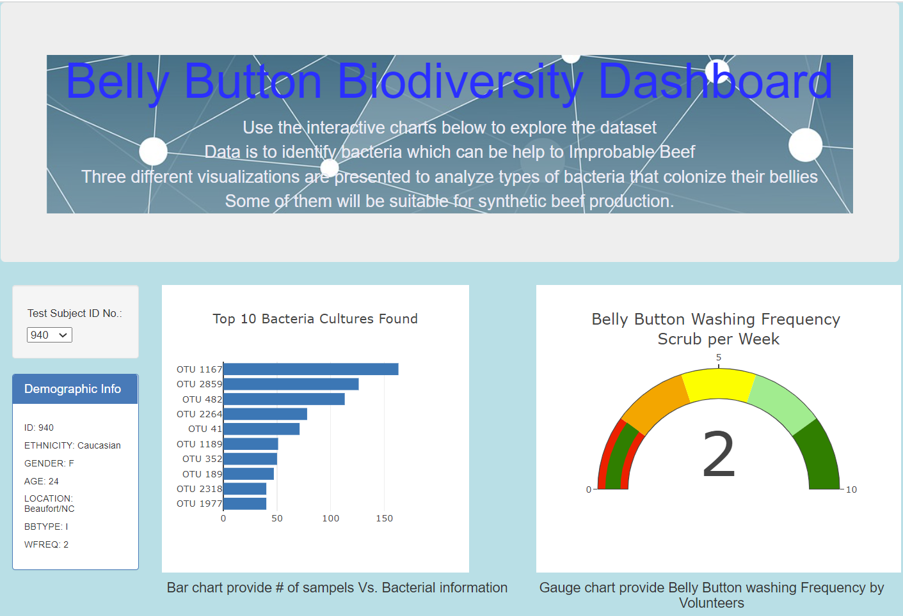
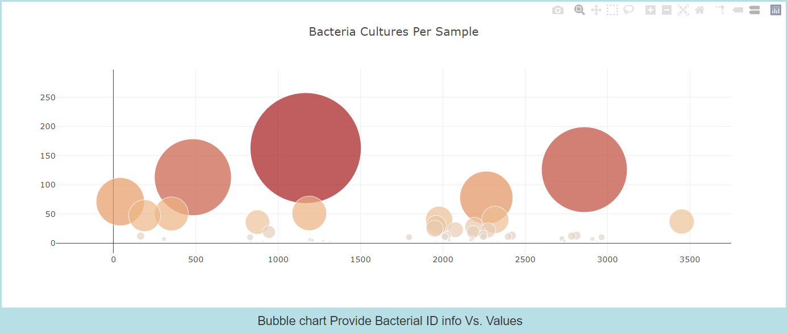

# Plotly_Belly
## 1. Overview of the analysis:
    This excersize is made to prepare and visualize the data. This data can help us to identify bacteria which can be help to prepare Improbable Beef. Three different visualizations are presented to analyze types of bacteria that colonize in bellies. Some of them will be suitable for synthetic beef production.

## 2. Results:
    Please refe the following web page developed with three different charts.

